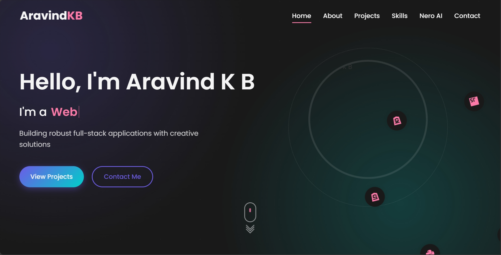

# Portfolio

Welcome to my Portfolio repository!  
I specialize in building modern web applications using **Next.js**, with a strong command over **Python**, **JavaScript**, and **C++**.

---

## 🚀 About Me

- **Full Stack Web Developer**  
- Completed **5 amazing projects** showcasing my expertise and creativity.
- Enthusiastic about learning new technologies and frameworks.
- Always eager to solve challenging problems and build scalable solutions.

---

## 🛠️ Tech Stack

- **Frontend:** Next.js, React, JavaScript, HTML, CSS
- **Backend:** Python, Node.js, C++
- **Other:** Git & GitHub, REST APIs

---

*Detailed write-ups and links can be found in the `projects/` folder or below.*

---

## 🌄 Portfolio Preview

<!-- Add your portfolio image below -->

---

## 📫 Contact

- **GitHub:** [kannanhacker123](https://github.com/kannanhacker123)

---

## ⭐️ Show your support

If you like my work, feel free to ⭐️ this repository and connect with me!

---

> *"Code is like humor. When you have to explain it, it’s bad."*
